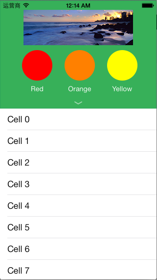
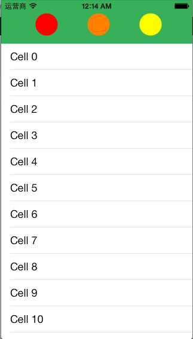
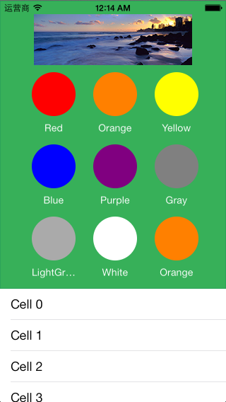

StretchTableHeaderViewDemo
==========================

Provide a stretch table header view on which you can put a grid of buttons. Perform subtle animations when scrolling. 

1. Show one row of buttons:

2. When the user scroll up the scroll view, the header view become smaller animationing.

3. When the user scroll down the scroll view, the header view expands to large one which has three rows of buttons.

